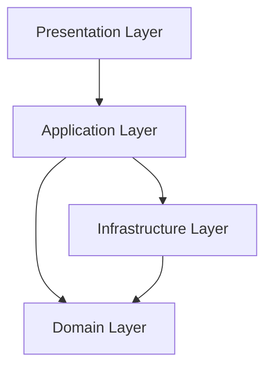

# 🏗️ Firmness - Intelligent Construction Management System

<div align="center">


[](https://dotnet.microsoft.com/)
[](https://angular.io/)
[](https://www.docker.com/)
[](https://www.postgresql.org/)
[](LICENSE)

**A comprehensive, enterprise-grade solution for managing construction machinery rentals and material sales.**
Combines **Clean Architecture** with **AI capabilities**, automated workflows, and seamless cloud integration.

[🚀 Quick Start](#-quick-start) • [📚 Documentation](#-documentation-hub) • [🏗️ Architecture](#-architecture--diagrams) • [🤖 AI Features](#-ai-powered-features)

</div>

---

## 🚀 Quick Start

### One-Command Deployment

The system uses a **Safety-First Deployment** pipeline. It builds, tests, and deploys in one go.

```bash
# Build, Run 90+ Tests, and Deploy
docker compose up --build
```

### Access Points

| Service         | URL                                                            | Credentials (Default)                  |
| --------------- | -------------------------------------------------------------- | -------------------------------------- |
| **Client App**  | [http://localhost:80](http://localhost:80)                     | `client@firmness.local` / `Client123!` |
| **Admin Panel** | [http://localhost:5001](http://localhost:5001)                 | `admin@firmness.local` / `Admin123!`   |
| **API Swagger** | [http://localhost:5000/swagger](http://localhost:5000/swagger) | -                                      |
| **PgAdmin**     | [http://localhost:8080](http://localhost:8080)                 | `admin@firmness.local` / `admin123`    |

---

## 📚 Documentation Hub

Everything you need to know, connected in one place.

### 📘 **Guides & Manuals**

- **[👉 Features & Setup Guide](docs/FEATURES_AND_SETUP.md)**
  - _Complete installation guide, Docker setup, and detailed feature walkthrough._
- **[📄 Excel & PDF Features](docs/building-data/EXCEL_IMPORT_EXPORT.md)**
  - _How to use Bulk Import/Export and generate PDF contracts._
- **[☁️ AWS S3 Storage](docs/building-data/S3_STORAGE.md)**
  - _File uploads, image storage, and CloudFront CDN integration._
- **[📧 Email Configuration](docs/setup/EMAIL_CONFIGURATION.md)**
  - _Gmail SMTP, SendGrid, AWS SES setup and usage._
- **[☁️ Environment & Configuration](docs/setup/ENVIRONMENT.md)**
  - _Configuration for Database, Email, and AWS S3._

### 🤖 **AI & Intelligence**

- **[🧠 AI Assistant Documentation](docs/AI/README.md)**
  - _Integration with Google Gemini, Chatbot architecture, and prompt engineering._
- **[🔧 AI Scripts](docs/AI/SCRIPTS.md)**
  - _Configuration, testing, and diagnostic scripts for the chatbot._

### 💻 **Development**

- **[🧪 Testing Guide](tests/Firmness.Test/README_TESTS.md)**
  - _How to run the 90+ automated tests and add new ones._
- **[🔌 API Reference](docs/api/ENDPOINTS.md)**
  - _Detailed list of REST API endpoints and usage._
- **[🔐 Authentication](docs/api/AUTHENTICATION.md)**
  - _JWT flow, Roles, and Security._
- **[🧪 API Testing Scripts](docs/api/SCRIPTS.md)**
  - _PowerShell scripts for testing endpoints and authentication._

---

## 🏗️ Architecture & Diagrams

Visual documentation to understand the system's core.

| Diagram               | Description                                  | Link                                         |
| --------------------- | -------------------------------------------- | -------------------------------------------- |
| **🔄 Use Case**       | Actors, Roles, and System Functionalities    | [**View Diagram**](docs/use-case-diagram.md) |
| **🏗️ Class Diagram**  | Domain Entities, Services, and Relationships | [**View Diagram**](docs/class-diagram.md)    |
| **🗄️ Database Model** | ERD, Schema, Tables, and Foreign Keys        | [**View Diagram**](docs/database-model.md)   |

### Clean Architecture Layers



---

## 🌟 Key Features

### 1. 🤖 AI-Powered Chatbot

Powered by **Google Gemini**, helping users find machinery, get quotes, and navigate the rental process via natural language.

### 2. 📊 Excel Import/Export

- **Bulk Import**: Upload thousands of products/customers via `.xlsx`.
- **Reporting**: Export financial data and inventory status instantly.

### 3. 📝 PDF Generation

- **Contracts**: Auto-generate legal rental contracts.
- **Invoices**: Create professional invoices on the fly.

### 4. ☁️ Cloud Integration

- **AWS S3**: Secure storage for vehicle images and documents.
- **CloudFront**: Fast content delivery network.

---

## 🛠️ Technology Stack

- **Backend**: .NET 8, ASP.NET Core Web API
- **Frontend**: Angular 17 (Standalone Components)
- **Database**: PostgreSQL 15
- **ORM**: Entity Framework Core
- **AI**: Google Gemini Pro
- **DevOps**: Docker, Docker Compose
- **Testing**: xUnit, Moq, FluentAssertions

---

## 🤝 Contributing

1.  Fork the repository.
2.  Create a feature branch: `git checkout -b feature/NewFeature`
3.  Commit changes: `git commit -m "feat: Add NewFeature"`
4.  **Run Tests**: `dotnet test` (Must pass!)
5.  Push to branch: `git push origin feature/NewFeature`
6.  Open a Pull Request.

---

<div align="center">
  <sub>Built with ❤️ by the Firmness Team</sub>
  <br>
  <a href="docs/FEATURES_AND_SETUP.md">Setup Guide</a> • 
  <a href="docs/AI/README.md">AI Docs</a> • 
  <a href="docs/api/ENDPOINTS.md">API Docs</a>
</div>
