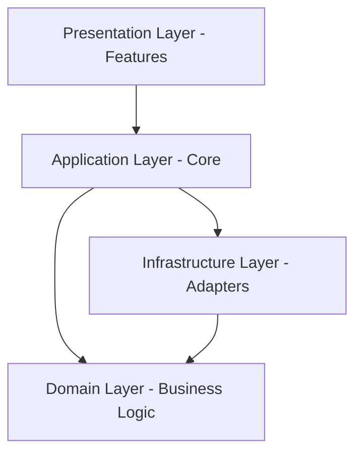
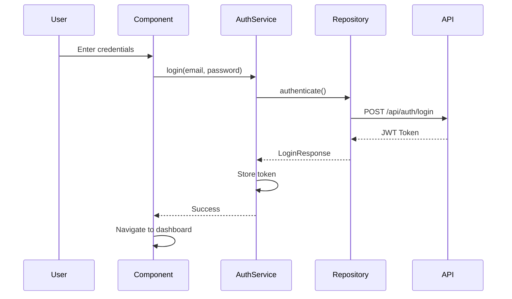

# Firmness - Angular Client

**Modern Angular 19 frontend** implementing **Clean Architecture** principles for the Firmness construction rental platform.

> 🏗️ **Clean Architecture** | 🎯 **Domain-Driven Design** | ⚡ **Standalone Components**

---

## 🏛️ Clean Architecture Overview

This project follows **Clean Architecture** (also known as Hexagonal Architecture or Ports & Adapters), ensuring:

- **Independence from frameworks** - Business logic doesn't depend on Angular
- **Testability** - Easy to test without UI or external dependencies
- **Independence from UI** - UI can change without affecting business rules
- **Independence from databases/APIs** - Easy to swap data sources
- **Separation of concerns** - Each layer has a single, well-defined responsibility

### Architecture Layers



---

## 📁 Project Structure

```
src/app/
├── 📦 domain/              # Enterprise Business Rules (Inner Layer)
│   ├── models/             # Business entities (Customer, Vehicle, Sale)
│   ├── enums/              # Domain enumerations (Role, Status)
│   ├── ports/              # Interfaces/Contracts
│   │   ├── repositories/   # Repository interfaces
│   │   └── services/       # Service interfaces
│   └── value-objects/      # Immutable domain objects
│
├── 🔧 infrastructure/      # Frameworks & Drivers (Outer Layer)
│   ├── http/               # HTTP adapters (API clients)
│   │   ├── interceptors/   # Auth & error interceptors
│   │   └── *.repository.ts # Repository implementations
│   ├── storage/            # LocalStorage adapters
│   ├── mappers/            # DTO ↔ Domain mappers
│   └── config/             # Configuration services
│
├── 💼 core/                # Application Business Rules (Use Cases)
│   ├── services/           # Application services (facades)
│   │   ├── auth.service.ts
│   │   └── *-facade.service.ts
│   ├── guards/             # Route guards (auth, role)
│   └── state/              # Application state management
│
├── 🎨 features/            # Presentation Layer (UI)
│   ├── auth/               # Authentication feature
│   ├── customers/          # Customer management
│   ├── products/           # Product catalog
│   ├── sales/              # Sales & checkout
│   └── vehicles/           # Vehicle rentals
│
├── 🖼️ layout/              # Layout Components
│   ├── header/
│   ├── footer/
│   └── shell/
│
└── 🔄 shared/              # Shared Resources
    ├── components/         # Reusable UI components
    ├── directives/         # Custom directives
    ├── pipes/              # Custom pipes
    └── utils/              # Utility functions
```

---

## 🚀 Quick Start

### Prerequisites

- **Node.js** 18+ ([Download](https://nodejs.org/))
- **Angular CLI** 19+ (`npm install -g @angular/cli`)
- **Backend API** running on `https://localhost:7192`

### Installation

```bash
# Install dependencies
npm install

# Start development server
npm start
```

Open your browser at **`http://localhost:4200/`**

---

## 📋 Available Scripts

| Command              | Description                     |
| -------------------- | ------------------------------- |
| `npm start`          | Start development server (4200) |
| `npm run build`      | Build for production            |
| `npm run build:dev`  | Build for development           |
| `npm test`           | Run unit tests                  |
| `npm run test:watch` | Run tests in watch mode         |
| `npm run lint`       | Lint code with ESLint           |

---

## 🏗️ Clean Architecture Layers Explained

### 1️⃣ **Domain Layer** (Enterprise Business Rules)

**Location:** `src/app/domain/`

The **core** of the application. Contains pure TypeScript with **zero dependencies** on frameworks.

**Responsibilities:**

- Define business entities and value objects
- Define interfaces (ports) for repositories and services
- Contain business rules and domain logic

**Example:**

```typescript
// domain/models/customer.model.ts
export class Customer {
  constructor(public id: string, public firstName: string, public lastName: string, public email: string, public documentNumber: string) {}

  get fullName(): string {
    return `${this.firstName} ${this.lastName}`;
  }
}

// domain/ports/repositories/customer.repository.ts
export interface CustomerRepository {
  findAll(): Observable<Customer[]>;
  findById(id: string): Observable<Customer>;
  create(customer: Customer): Observable<Customer>;
  update(id: string, customer: Customer): Observable<Customer>;
  delete(id: string): Observable<void>;
}
```

---

### 2️⃣ **Infrastructure Layer** (Frameworks & Drivers)

**Location:** `src/app/infrastructure/`

Implements the **ports** defined in the domain layer using external frameworks (Angular HTTP, LocalStorage, etc.).

**Responsibilities:**

- Implement repository interfaces using HTTP
- Handle API communication
- Manage local storage
- Map DTOs to domain models

**Example:**

```typescript
// infrastructure/http/customer-http.repository.ts
@Injectable({ providedIn: "root" })
export class CustomerHttpRepository implements CustomerRepository {
  private apiUrl = `${environment.apiUrl}/customers`;

  constructor(private http: HttpClient) {}

  findAll(): Observable<Customer[]> {
    return this.http.get<CustomerDto[]>(this.apiUrl).pipe(map((dtos) => dtos.map((dto) => CustomerMapper.toDomain(dto))));
  }

  // ... other methods
}
```

---

### 3️⃣ **Core Layer** (Application Business Rules)

**Location:** `src/app/core/`

Contains **use cases** and application-specific business rules. Orchestrates the flow of data between layers.

**Responsibilities:**

- Implement application services (facades)
- Coordinate between domain and infrastructure
- Handle authentication and authorization
- Manage application state

**Example:**

```typescript
// core/services/customer-facade.service.ts
@Injectable({ providedIn: "root" })
export class CustomerFacadeService {
  constructor(
    @Inject(CUSTOMER_REPOSITORY_TOKEN)
    private repository: CustomerRepository
  ) {}

  getAllCustomers(): Observable<Customer[]> {
    return this.repository.findAll();
  }

  // ... other use cases
}
```

---

### 4️⃣ **Features Layer** (Presentation)

**Location:** `src/app/features/`

Contains **UI components** organized by feature. Depends on the core layer to execute use cases.

**Responsibilities:**

- Display data to users
- Capture user input
- Route navigation
- Call facade services

**Example:**

```typescript
// features/customers/pages/customer-list/customer-list.component.ts
@Component({
  selector: "app-customer-list",
  templateUrl: "./customer-list.component.html",
})
export class CustomerListComponent implements OnInit {
  customers$ = this.customerFacade.getAllCustomers();

  constructor(private customerFacade: CustomerFacadeService) {}
}
```

---

## 🎯 Key Features

### ✅ **Architecture**

- Clean Architecture (Hexagonal/Ports & Adapters)
- Domain-Driven Design principles
- Dependency Inversion Principle
- Separation of Concerns

### ✅ **Angular 19**

- Standalone Components
- Signals for reactive state
- Lazy-loaded feature modules
- Modern Angular best practices

### ✅ **Security**

- JWT Authentication with HTTP interceptors
- Role-based access control (RBAC)
- Route guards (auth, role)
- Secure token storage

### ✅ **Developer Experience**

- TypeScript strict mode
- Path aliases (`@domain`, `@core`, `@infrastructure`)
- Reactive forms with validation
- Comprehensive error handling

---

## 🔌 API Integration

### Backend Connection

- **Base URL:** `https://localhost:7192/api`
- **Protocol:** REST API
- **Authentication:** JWT Bearer Token
- **Format:** JSON

### Key Endpoints

| Feature   | Repository               | Endpoint         |
| --------- | ------------------------ | ---------------- |
| Auth      | `AuthHttpRepository`     | `/api/auth`      |
| Customers | `CustomerHttpRepository` | `/api/customers` |
| Products  | `ProductHttpRepository`  | `/api/products`  |
| Vehicles  | `VehicleHttpRepository`  | `/api/vehicles`  |
| Rentals   | `RentalHttpRepository`   | `/api/rentals`   |
| Sales     | `SaleHttpRepository`     | `/api/sales`     |

See **[API Documentation](../docs/api/ENDPOINTS.md)** for complete reference.

---

## 🔐 Authentication Flow



**Implementation:**

1. User submits login form
2. `AuthService` calls `AuthRepository`
3. Repository makes HTTP request to API
4. JWT token stored in `LocalStorage`
5. `AuthInterceptor` adds token to all requests
6. `AuthGuard` protects private routes

---

## 🧪 Testing

```bash
# Run all tests
npm test

# Run tests in watch mode
npm run test:watch

# Generate coverage report
npm test -- --code-coverage
```

### Testing Strategy

- **Unit Tests:** Test domain models and services in isolation
- **Integration Tests:** Test repository implementations with mocked HTTP
- **Component Tests:** Test UI components with mocked services

---

## 🏗️ Building for Production

```bash
# Build with production configuration
npm run build

# Output directory
dist/client/browser/
```

### Production Optimizations

- ✅ Ahead-of-Time (AOT) compilation
- ✅ Tree shaking and dead code elimination
- ✅ Minification and uglification
- ✅ Lazy loading of feature modules
- ✅ Service worker for PWA (optional)

---

## 🧩 Technology Stack

| Technology         | Version | Purpose                     |
| ------------------ | ------- | --------------------------- |
| **Angular**        | 19.2+   | Frontend framework          |
| **TypeScript**     | 5.7+    | Type-safe programming       |
| **RxJS**           | 7.8+    | Reactive programming        |
| **TailwindCSS**    | 3.x     | Utility-first CSS framework |
| **Angular Router** | 19.2+   | Client-side routing         |
| **HttpClient**     | 19.2+   | HTTP communication          |

---

## 📝 Development Guidelines

### Adding a New Feature

Follow Clean Architecture principles:

1. **Define Domain Model** (`domain/models/`)

   ```typescript
   export class Product {
     constructor(public id: string, public name: string) {}
   }
   ```

2. **Define Repository Interface** (`domain/ports/repositories/`)

   ```typescript
   export interface ProductRepository {
     findAll(): Observable<Product[]>;
   }
   ```

3. **Implement Repository** (`infrastructure/http/`)

   ```typescript
   export class ProductHttpRepository implements ProductRepository {
     // Implementation using HttpClient
   }
   ```

4. **Create Facade Service** (`core/services/`)

   ```typescript
   export class ProductFacadeService {
     constructor(private repo: ProductRepository) {}
   }
   ```

5. **Build UI Components** (`features/products/`)
   ```typescript
   export class ProductListComponent {
     products$ = this.facade.getAllProducts();
   }
   ```

### Code Style

- Use **TypeScript strict mode**
- Follow **Angular style guide**
- Use **path aliases** for imports
- Write **meaningful variable names**
- Add **JSDoc comments** for public APIs

---

## 📚 Documentation

### Architecture & Design

- **[Architecture Overview](./docs/ARCHITECTURE.md)** - Complete Clean Architecture explanation
- **[Implementation Guide](./docs/IMPLEMENTATION_GUIDE.md)** - Step-by-step implementation
- **[Hexagonal Alignment](./docs/HEXAGONAL_ALIGNMENT.md)** - Backend alignment guide

### API & Backend

- **[API Endpoints](../docs/api/ENDPOINTS.md)** - REST API reference
- **[Authentication](../docs/api/AUTHENTICATION.md)** - JWT authentication flow
- **[API Testing Scripts](../docs/api/SCRIPTS.md)** - Testing utilities

### General

- **[Main Documentation Hub](../docs/README.md)** - All project documentation
- **[Backend Architecture](../docs/development/ARCHITECTURE.md)** - Backend Clean Architecture

---

## 🤝 Contributing

We follow Clean Architecture principles. When contributing:

1. **Respect layer boundaries** - Don't let outer layers leak into inner layers
2. **Use dependency injection** - Inject dependencies through constructors
3. **Write tests** - Maintain high test coverage
4. **Follow conventions** - Use established patterns and naming
5. **Document changes** - Update relevant documentation

---

## 📄 License

See [LICENSE](../LICENSE) file in the root directory.

---

<div align="center">

### 🏗️ Clean Architecture | 🎯 Domain-Driven Design | ⚡ Angular 19

**[📚 Full Documentation](../docs/README.md)** • **[🔌 API Reference](../docs/api/ENDPOINTS.md)** • **[⬅️ Main README](../README.md)**

</div>
